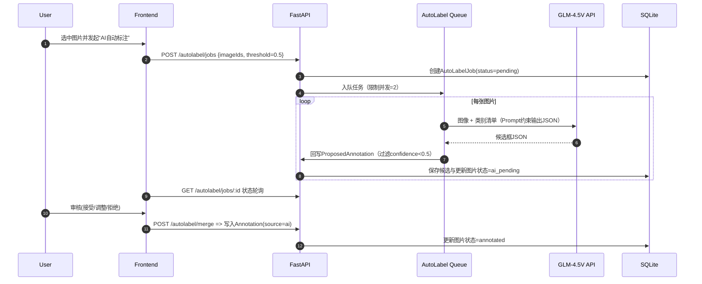

# 产品需求文档（PRD）— 图片标注与训练平台

## 核心目标（Mission）
- 让非算法工程师以最短路径完成“导入 →（AI辅助）标注 → YOLOv11训练 → 下载 .pt/.onnx”，在单机GPU环境下稳定可用。

## 用户画像（Persona）
- 目标用户：中小团队工程师、AI初学者、PoC负责人。
- 核心痛点：标注效率低、训练链路复杂、格式不统一、模型导出不顺畅。
- JTBD：批量导入图片 → 快速矩形框标注（含AI候选） → 一键训练 → 下载可用模型。

## V1: 最小可行产品（MVP）
- 项目与数据
  - 创建项目（名称、描述、类别清单）。
  - 图片导入：上传zip（jpg/png），自动解压、checksum去重，统计未标/已标。
- 标注工作台（仅BBox）
  - 画框/移动/缩放/删除/复制；类别选择；缩放/拖拽；撤销/重做。
  - 图片状态：未标注/AI待审/已标注；最小尺寸校验、重复框提醒。
- AI自动标注（GLM-4.5V）
  - 一键触发对选中图片批处理；并发=2；置信阈值=0.5。
  - 输出候选框（class,x,y,w,h,confidence），进入“AI待审”队列。
  - 人工复核：逐图或批量接受/调整/拒绝；确认后写入正式标注（source=ai）。
- 训练与产物（YOLOv11）
  - 条件：≥50张已标注图片；自动80/20划分；默认 epochs=50、imgsz=640、batch=auto、seed=42、变体默认`yolov11n`。
  - 训练队列单并发；实时日志/进度；完成导出`.pt`与`.onnx`（opset=12）；展示 mAP、precision、recall。
- 账户与基础
  - 单用户登录；项目列表；活动日志（导入/AI标注/训练/下载）。
  - SQLite存元数据与任务；文件系统存图片/标签/模型产物。

## V2 及以后版本（Future Releases）
- AI增强：批量并发队列管理、断点续跑、类别映射器、不确定性排序与主动学习、轻量本地推理混合策略。
- 协作与质检：多用户/角色、任务派发、复审流、质检统计、审计日志。
- 训练/评估：多并发、断点续训、曲线对比、误检分析、混淆矩阵、超参模板。
- 集成/扩展：云存储（S3/OSS）、COCO/TFRecord导出、Webhook/SDK、TensorRT导出。
- 体验/规模：大文件断点续传、缓存/CDN、国际化、可访问性与主题。

## 关键业务逻辑（Business Rules）
- 类别：训练前可编辑；训练启动后冻结对应版本。
- 导入：仅zip；按checksum去重；解析失败文件入日志。
- 标注：仅BBox；每条标注必须绑定类别；撤销/重做；图片状态驱动流程。
- AI自动标注：GLM-4.5V并发=2；confidence≥0.5才入候选；必须人工审核后方可计入训练集。
- 训练：同项目同一时间仅1个训练；产物（.pt/.onnx）与指标与数据版本绑定；提供下载与软删。

## 数据契约（Data Contract, MVP）
- Project: id, name, description?, status, createdAt
- Class: id, projectId, name, color?, hotkey?
- Image: id, projectId, path, width, height, checksum, status[unannotated|ai_pending|annotated], createdAt
- Annotation: id, imageId, classId, type='bbox', bbox{x,y,w,h}, confidence?, source['manual'|'ai'], createdAt
- ProposedAnnotation: id, imageId, classId?, bbox{x,y,w,h}, confidence, provider='glm4.5v', payload, createdAt
- AutoLabelJob: id, projectId, status[pending|running|succeeded|failed|canceled], params{concurrency=2,threshold=0.5}, counts{images,boxes}, logsRef, startedAt, finishedAt
- TrainingJob: id, projectId, datasetVersionId, status, params{modelVariant,epochs,imgsz,batch,seed}, metrics{map50,map50_95,precision,recall}, logsRef, startedAt, finishedAt
- ModelArtifact: id, trainingJobId, format['pt'|'onnx'], path, size, checksum, createdAt
- User: id, username/email, passwordHash, role='admin'
- ActivityLog: id, userId, projectId?, type['import'|'ai_autolabel_start'|'ai_autolabel_merge'|'train_start'|'train_end'|'download'], payload, createdAt
- 文件结构（YOLO）：`datasets/<project>/{images|labels}/{train|val}/...`，标签`.txt`行格式：`class x y w h`（归一化）。

## 选定MVP原型图 A（工作台一体式）
```
+----------------------------------------------------------------------------------+
| Topbar: 项目名 | 类别管理 | 搜索 | [导入zip] [AI自动标注] [开始训练] [下载模型]      |
+-------------------------+----------------------------------+-------------------+
| 左侧：图片列表          |            中央：标注画布（BBox） | 右侧：属性/类别   |
| - 全部/未标/AI待审/已标 |  -------------------------------- | - 类别选择(快捷键)|
| - 缩略图+状态点         |  |  图像 | 框 | 缩放 | 网格 |   | - 标注明细列表    |
| - 批量选择/筛选         |  -------------------------------- | - 元信息/快捷键   |
+-------------------------+----------------------------------+-------------------+
| 底部任务栏：训练进度条 | 实时日志 | AI自动标注队列(并发2) | 事件提示           |
+----------------------------------------------------------------------------------+
```

### 原型A关键交互说明
- 顶部主CTA：随上下文切换为“导入zip/AI自动标注/开始训练/下载模型”。
- 左侧筛选：支持“AI待审”快速筛；批量选择后可触发AI自动标注或批量审核。
- 中央画布：优先流畅度（低延迟绘制与缩放），支持撤销/重做和快捷键绑定类别。
- 右侧面板：展示当前图片的标注列表，可对单一框编辑类别与坐标；显示来源（manual/ai）。
- 底部任务栏：并列显示“AI自动标注队列（并发2）”与“训练任务”（单并发）进度与日志。

---

# 架构设计蓝图

## 技术选型
- 前端：React + Vite（或CRA），Canvas/Stage用于BBox绘制（Konva或原生Canvas）。
- 后端：FastAPI（Uvicorn）；SQLite（SQLModel/SQLAlchemy）；Pydantic v2。
- 训练：YOLOv11（Ultralytics系列），PyTorch，GPU本地训练；导出ONNX（opset=12）。
- 任务队列：MVP使用FastAPI后台任务 + 简易内存队列；后续可切换RQ/Celery。
- 自动标注：GLM-4.5V 官方API（并发=2，速率限制与重试）。
- 存储：本地文件系统（datasets/ 与 models/），N天后归档策略可在V2加入。

## 目录与模块（建议）
- frontend/
  - src/pages/Projects.tsx（项目列表与导入）
  - src/pages/Annotator.tsx（工作台主界面）
  - src/components/CanvasBBox.tsx（标注画布）
  - src/components/AIReviewPanel.tsx（AI待审与批量合并）
  - src/components/TrainBar.tsx（底部任务栏与日志）
  - src/api/client.ts（REST API封装）
- backend/app/
  - main.py（FastAPI入口、路由注册、CORS与Auth中间件）
  - db.py（SQLite连接、迁移/初始化）
  - models.py（ORM与Pydantic模型）
  - routers/
    - projects.py（项目/类别/导入）
    - images.py（图片浏览/状态）
    - annotations.py（标注CRUD）
    - autolabel.py（AI自动标注：创建任务、并发=2、结果回写ProposedAnnotation）
    - training.py（训练作业：创建/状态/下载产物）
  - services/
    - glm_autolabel.py（GLM-4.5V调用与JSON解析、阈值过滤、错误重试）
    - training_yolo.py（数据集快照、YOLOv11训练、指标解析、ONNX导出）
  - workers/
    - queue.py（简易任务队列，限制AI并发=2与训练单并发）
    - utils.py（日志、校验、哈希、图像元信息提取）
- datasets/<project>/{images|labels}/{train|val}/...
- models/<project>/<job_id>/{weights.pt, model.onnx, metrics.json, logs.txt}

## 核心流程图（Mermaid）

### 自动标注（GLM-4.5V）


### 训练与导出（YOLOv11）
```mermaid
flowchart TD
  A[Start: 点击开始训练] --> B{已标注图片 >= 50?}
  B -- 否 --> Z[提示不足，阻止训练]
  B -- 是 --> C[冻结类别 & 生成数据集快照]
  C --> D[按80/20划分 train/val]
  D --> E[启动YOLOv11训练 (GPU)]
  E --> F{训练完成?}
  F -- 失败 --> R[记录失败日志 & 失败状态]
  F -- 成功 --> G[保存最佳.pt]
  G --> H[导出ONNX(opset=12)]
  H --> I[解析metrics: mAP/P/R]
  I --> J[更新TrainingJob & ModelArtifact]
  J --> K[前端可下载 .pt / .onnx]
```

## 组件交互说明（影响与关系）
- 新增模块
  - `routers/autolabel.py` ↔ `services/glm_autolabel.py`：创建与调度AI标注任务，保存`ProposedAnnotation`，并发限制=2。
  - `routers/training.py` ↔ `services/training_yolo.py`：校验门槛、快照数据集、训练、导出与指标解析。
  - `workers/queue.py`：统一调度AI与训练作业（MVP内存实现），前端通过轮询获取状态与日志。
- 现有关系（建议）
  - `images.py` 与 `annotations.py`：维护图片状态流转（unannotated → ai_pending → annotated）。
  - `projects.py`：项目与类别管理；训练启动时冻结当前类别清单。
  - 前端 `Annotator.tsx`：与 `CanvasBBox.tsx`、`AIReviewPanel.tsx` 协作，底部 `TrainBar.tsx` 显示两个队列。

## 接口草案（MVP）
- POST `/projects` | GET `/projects/:id`
- POST `/projects/:id/import`（zip）
- GET `/projects/:id/images`（支持状态过滤）
- GET `/images/:id` | GET `/images/:id/annotations`
- POST `/annotations` | PUT `/annotations/:id` | DELETE `/annotations/:id`
- POST `/autolabel/jobs` | GET `/autolabel/jobs/:id` | POST `/autolabel/merge`
- POST `/training/jobs` | GET `/training/jobs/:id` | GET `/training/jobs/:id/artifacts`
- GET `/activity`（活动日志）

## 技术风险与缓解
- GLM API限速/不稳定：并发固定为2，指数退避重试；失败记录与可重试；人工审核作为护栏。
- YOLOv11版本兼容性：锁定Ultralytics版本；提供环境锁文件；确保ONNX导出(opset=12)通过基本校验。
- GPU与资源占用：单并发训练；batch=auto；限制同时训练数量=1，避免显存爆。
- SQLite并发写：长任务减少频繁写入，采用批量提交；必要时迁移至PostgreSQL（V2）。
- 大文件上传：MVP使用zip直传；V2引入断点续传与校验。
- 画布性能：优先原生Canvas/Konva；大图按需缩放与延迟渲染。

## 默认参数（可配置）
- YOLOv11变体：`yolov11n`（可选`s/m`）
- 训练：epochs=50, imgsz=640, batch=auto, seed=42
- 最小训练门槛：N=50已标注图片
- 自动标注：GLM并发=2，阈值=0.5，超时=30s/图，批大小建议≤200
- 导出：ONNX opset=12

---

以上为最终确认的“产品路线图”、选定原型图A与架构设计蓝图。若需微调参数（例如默认epochs或阈值），请指出；否则可据此启动实现。
